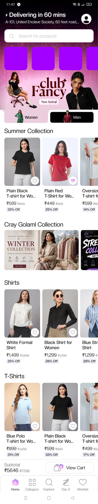
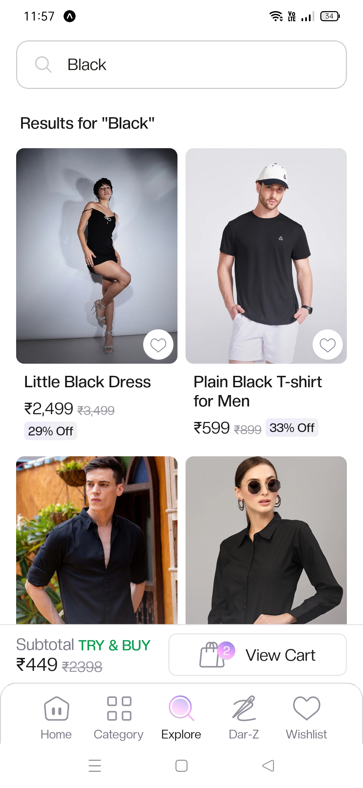
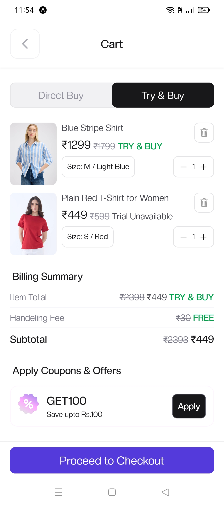
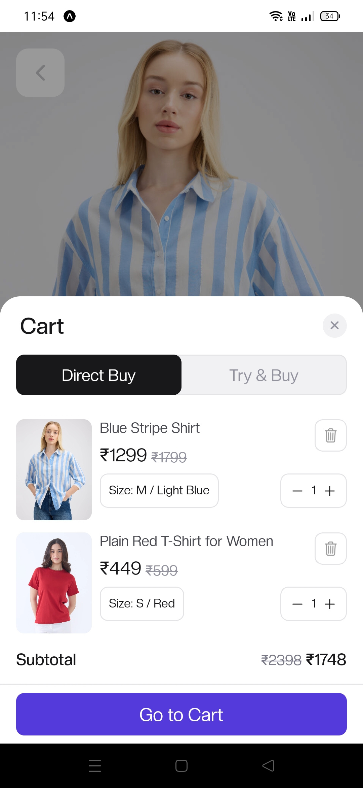
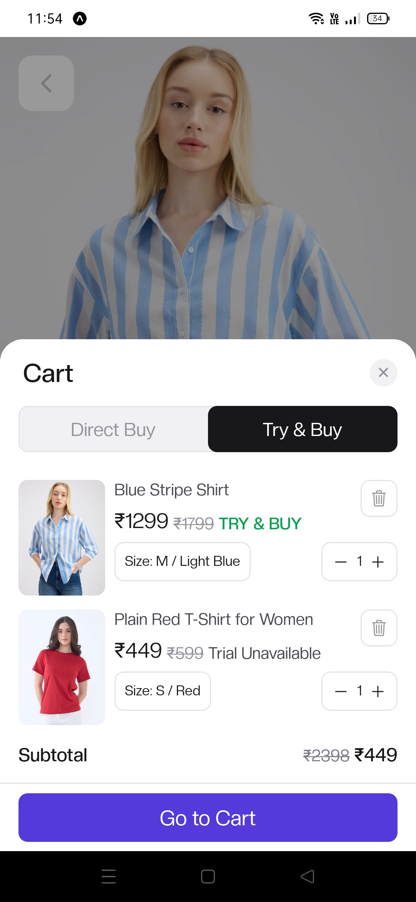
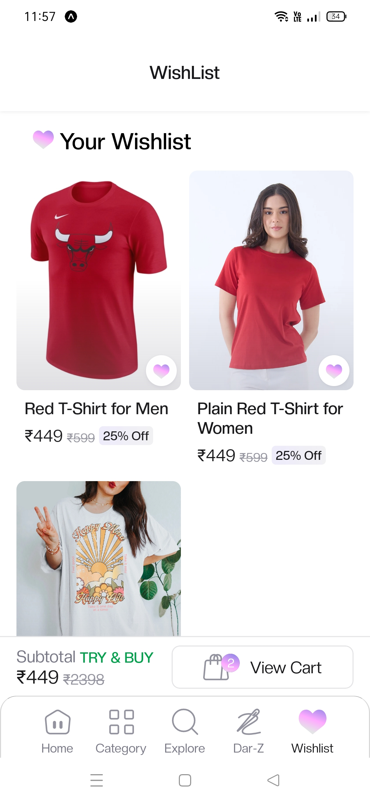
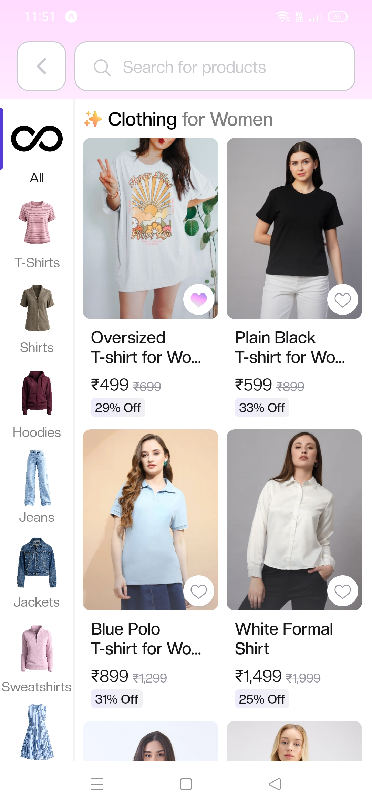
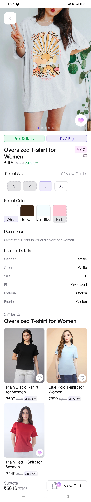
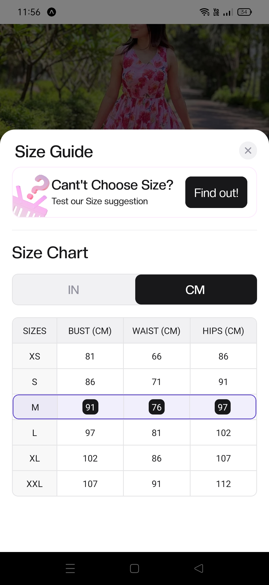
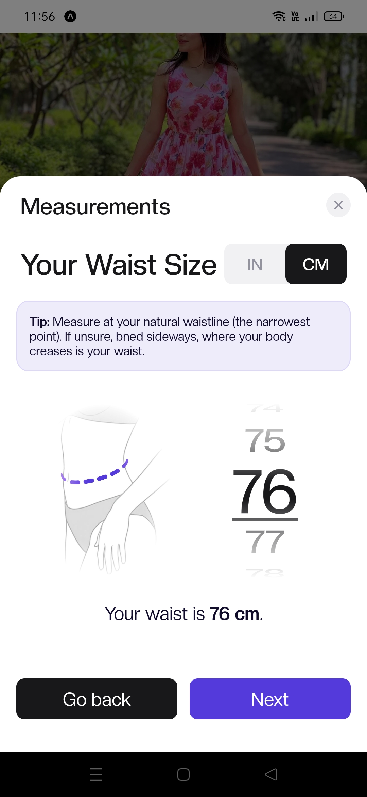

# Fashion E-Commerce App

A React Native (Expo) e-commerce app UI featuring browsing, cart, checkout, order tracking, and wishlist screens.

## 📱 Screenshots

<!--
Replace the placeholder lines below with your actual images.
Recommended: put your screenshots in a `/screenshots` folder in the repo root,
then reference them like: 
-->

### Home



### Search



### Cart





### Wishlist



### Cotegories



### Product



### Size Chart




<br/>

## 🎥 Demo Video

<!--
GitHub renders video files uploaded directly to an issue/PR/README via drag-and-drop,
which generates a URL like the one below. Upload your .mp4 through the GitHub web UI
(open a new issue, drag the video in, copy the generated link) then paste it here.
-->

https://github.com/user-attachments/assets/your-video-id-here

https://github.com/user-attachments/assets/3f02d134-9372-4bde-8870-33fdeebb9b1f

https://github.com/user-attachments/assets/b36818bf-376a-4126-aab8-d9d3f1d1bdf4


<!--
Alternative: link to a video hosted elsewhere (YouTube, Loom, etc.)
[](https://www.youtube.com/watch?v=your-video-id)
-->

## 🛠 Tech Stack

- [React Native](https://reactnative.dev/)
- [Expo](https://expo.dev/)
- [Expo Router](https://docs.expo.dev/router/introduction/)
- [Supabase](https://supabase.com/) — auth & backend

## 🚀 Getting Started

```bash
# Install dependencies
npm install

# Start the development server
npx expo start
```

Scan the QR code with the Expo Go app, or run on a simulator:

```bash
npx expo start --ios     # iOS simulator
npx expo start --android # Android emulator
```

## 📂 Project Structure

```
.
├── app/                # Screens (expo-router)
├── components/         # Reusable UI components
├── hooks/               # Custom hooks (e.g. auth context)
├── lib/                 # Supabase client, utilities
└── screenshots/         # App screenshots used in this README
```

## 📄 License

Add your license here.
